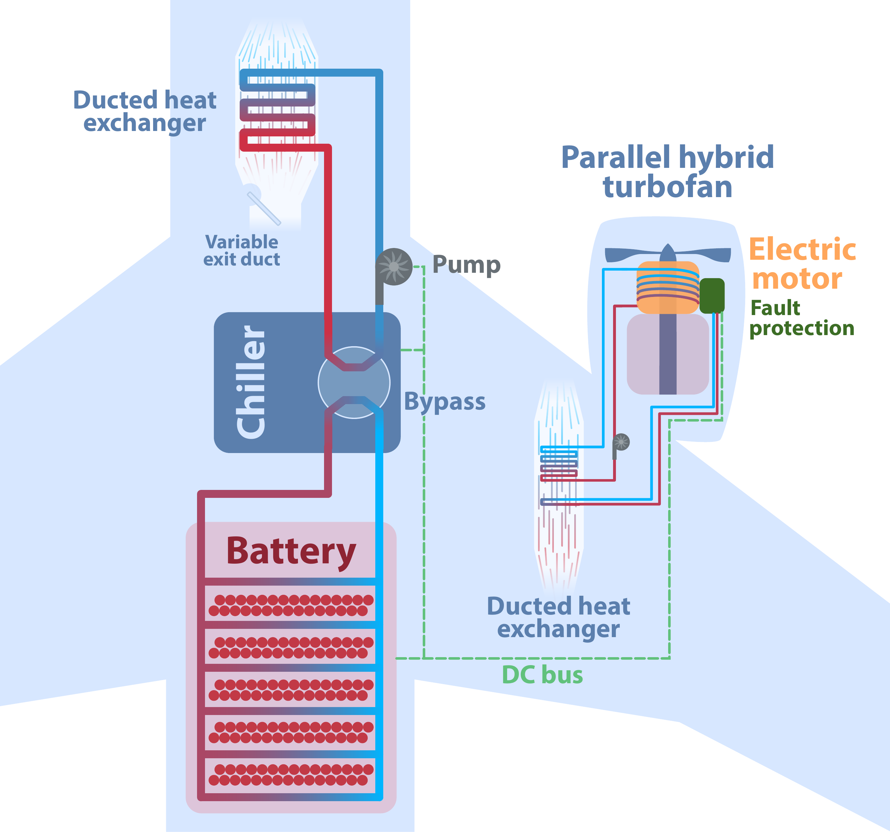

.. openconcept documentation master file, created by
   sphinx-quickstart on Sun Jul  1 14:07:26 2018.
   You can adapt this file completely to your liking, but it should at least
   contain the root `toctree` directive.

OpenConcept
===========

OpenConcept is a toolkit for the conceptual design of aircraft.
It is open source (GitHub: https://github.com/mdolab/openconcept) and MIT licensed.
OpenConcept was developed in order to model and optimize aircraft with electric propulsion at low computational cost.
The tools are built on top of NASA Glenn's `OpenMDAO <http://openmdao.org/>`__ framework, which in turn is written in Python.

OpenConcept is capable of modeling a wide range of propulsion systems, including detailed thermal management systems.
The following figure (from `this paper <https://doi.org/10.3390/aerospace9050243>`__) shows one such system that is modeled in the ``N3_HybridSingleAisle_Refrig.py`` example.

|

The following charts show more than 250 individually optimized hybrid-electric light twin aircraft (similar to a King Air C90GT).
Optimizing hundreds of configurations can be done in a couple of hours on a standard laptop computer.

.. image:: _static/images/readme_charts.png
    :width: 600px
    :align: center

|

The reason for OpenConcept's efficiency is the analytic derivatives built into each analysis routine and component.
Accurate, efficient derivatives enable the use of Newton nonlinear equation solutions and gradient-based optimization at low computational cost.

---------------
Getting Started
---------------
OpenConcept can be pip installed directly from PyPI with ``pip install openconcept``.

To run the examples or edit the source code:

#. Clone the repo to disk (``git clone https://github.com/mdolab/openconcept``)
#. Navigate to the root ``openconcept`` folder
#. Run ``pip install -e .`` to install the package (the ``-e`` can be omitted if not editing the source)

Get started by following the tutorials to learn the most important parts of OpenConcept.
The features section of the documentation describes most of the components and system models available in OpenConcept.

------------
Dependencies
------------

.. Remember to change in the readme too!

OpenConcept is tested regularly on builds with the oldest and latest supported package versions. The package versions in the oldest and latest builds are the following:

.. list-table::
   :header-rows: 1

   * - Package
     - Oldest
     - Latest
   * - Python
     - 3.8
     - 3.11
   * - OpenMDAO
     - 3.10
     - latest
   * - NumPy
     - 1.20
     - latest
   * - SciPy
     - 1.6.0
     - latest
   * - OpenAeroStruct
     - latest
     - latest

---------------
Please Cite Us!
---------------

Please cite this software by reference to the `conference paper <https://www.researchgate.net/publication/326263660_Development_of_a_Conceptual_Design_Model_for_Aircraft_Electric_Propulsion_with_Efficient_Gradients>`__:

Benjamin J. Brelje and Joaquim R.R.A. Martins.
"Development of a Conceptual Design Model for Aircraft Electric Propulsion with Efficient Gradients",
2018 AIAA/IEEE Electric Aircraft Technologies Symposium,
AIAA Propulsion and Energy Forum, (AIAA 2018-4979) DOI: 10.2514/6.2018-4979

.. code-block:: bibtex

    @inproceedings{Brelje2018,
	address = {{C}incinnati,~{OH}},
	author = {Benjamin J. Brelje and Joaquim R. R. A. Martins},
	booktitle = {2018 AIAA/IEEE Electric Aircraft Technologies Symposium},
	month = {July},
	title = {Development of a Conceptual Design Model for Aircraft Electric Propulsion with Efficient Gradients},
	year = {2018},
	doi = {10.2514/6.2018-4979}
	}

If using the integrated OpenAeroStruct VLM or aerostructural aerodynamic models, please cite the following `journal paper <https://www.researchgate.net/publication/366553107_Efficient_Aerostructural_Wing_Optimization_Considering_Mission_Analysis>`__:

Eytan J. Adler and Joaquim R.R.A. Martins, "Efficient Aerostructural Wing Optimization Considering Mission Analysis", AIAA Journal of Aircraft, December 2022. DOI: 10.2514/1.c037096

.. code-block:: bibtex

    @article{Adler2022d,
	author = {Adler, Eytan J. and Martins, Joaquim R. R. A.},
	doi = {10.2514/1.c037096},
	issn = {1533-3868},
	journal = {Journal of Aircraft},
	month = {December},
	publisher = {American Institute of Aeronautics and Astronautics},
	title = {Efficient Aerostructural Wing Optimization Considering Mission Analysis},
	year = {2022}
	}

.. currentmodule:: openconcept

.. toctree::
   :maxdepth: 2
   :caption: Tutorials
   :hidden:

   tutorials/minimal_example.rst
   tutorials/integrator.rst
   tutorials/turboprop.rst
   tutorials/more_examples.rst

.. toctree::
   :maxdepth: 2
   :caption: Features
   :hidden:

   features/aerodynamics.rst
   features/atmospherics.rst
   features/costs.rst
   features/energy_storage.rst
   features/mission.rst
   features/propulsion.rst
   features/thermal.rst
   features/weights.rst
   features/utilities.rst

.. toctree::
   :maxdepth: 2
   :caption: Other Useful Docs
   :hidden:

   _srcdocs/index.rst
   developer/roadmap.rst
   publications.rst
