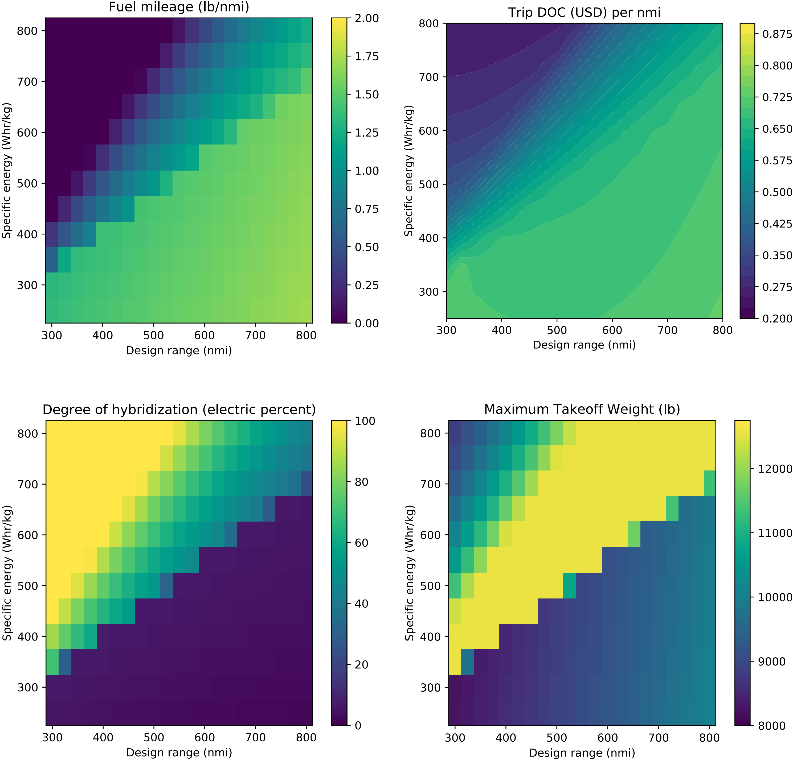

.. openconcept documentation master file, created by
   sphinx-quickstart on Sun Jul  1 14:07:26 2018.
   You can adapt this file completely to your liking, but it should at least
   contain the root `toctree` directive.

OpenConcept
===========

OpenConcept is a toolkit for the conceptual design of aircraft.
It is open source (GitHub: https://github.com/mdolab/openconcept) and MIT licensed.
OpenConcept was developed in order to model and optimize aircraft with electric propulsion at low computational cost.
The tools are built on top of NASA Glenn's `OpenMDAO <http://openmdao.org/>`__ framework, which in turn is written in Python.

The following charts show more than 250 individually optimized hybrid-electric light twin aircraft (similar to a King Air C90GT).
Optimizing hundreds of configurations can be done in a couple of hours on a standard laptop computer.

The reason for OpenConcept's efficiency is the analytic derivatives built into each analysis routine and component.
Accurate, efficient derivatives enable the use of Newton nonlinear equation solutions and gradient-based optimization at low computational cost.

---------------
Getting Started
---------------
OpenConcept can be pip installed directly from PyPI with ``pip install openconcept``.

To run the examples or edit the source code:

#. Clone the repo to disk (``git clone https://github.com/mdolab/openconcept``)
#. Navigate to the root ``openconcept`` folder
#. Run ``pip install -e .`` to install the package (the ``-e`` can be omitted if not editing the source)

Get started by running the ``TBM850`` example:

#. Navigate to the ``examples`` folder
#. Run ``python TBM850.py`` to test OpenConcept on a single-engine turboprop aircraft (the TBM 850)
#. Look at the ``examples/aircraft data/TBM850.py`` file to play with the assumptions / config / geometry and see the effects on the output result

``examples/HybridTwin.py`` is set up to do MDO in a grid of specific energies and design ranges and save the results to disk. Visualization utilities will be added soon (to produce contour plots as shown in this Readme).

------------
Dependencies
------------
This toolkit requires the use of `OpenMDAO <https://openmdao.org>`__ 3.10.0 or later due to backward-incompatible changes. OpenMDAO requires a recent NumPy and SciPy.
Python 3.8 is recommended since it is the version with which the code is tested, but newer Python versions will likely work as well.

---------------
Please Cite Us!
---------------

Please cite this software by reference to the `conference paper <https://www.researchgate.net/publication/326263660_Development_of_a_Conceptual_Design_Model_for_Aircraft_Electric_Propulsion_with_Efficient_Gradients>`__:

Benjamin J. Brelje and Joaquim R.R.A. Martins.
"Development of a Conceptual Design Model for Aircraft Electric Propulsion with Efficient Gradients",
2018 AIAA/IEEE Electric Aircraft Technologies Symposium,
AIAA Propulsion and Energy Forum, (AIAA 2018-4979) DOI: 10.2514/6.2018-4979

.. code-block:: bibtex

    @inproceedings{Brelje2018,
	address = {{C}incinnati,~{OH}},
	author = {Benjamin J. Brelje and Joaquim R. R. A. Martins},
	booktitle = {2018 AIAA/IEEE Electric Aircraft Technologies Symposium},
	month = {July},
	title = {Development of a Conceptual Design Model for Aircraft Electric Propulsion with Efficient Gradients},
	year = {2018},
	doi = {10.2514/6.2018-4979}
	}

If using the integrated OpenAeroStruct VLM or aerostructural aerodynamic models, please cite the following `conference paper <https://www.researchgate.net/publication/357559489_Aerostructural_wing_design_optimization_considering_full_mission_analysis>`__:

Eytan J. Adler and Joaquim R.R.A. Martins, "Aerostructural wing design optimization considering full mission analysis", 2022 AIAA SciTech Forum, San Diego, CA, January 2022. DOI: 10.2514/6.2022-0382

.. code-block:: bibtex

    @inproceedings{Adler2022a,
	author      = {Eytan J. Adler and Joaquim R. R. A. Martins},
	title       = {Aerostructural wing design optimization considering full mission analysis},
	booktitle   = {AIAA SciTech Forum},
	doi         = {10.2514/6.2022-0382},
	month       = {January},
	year        = {2022}
	}

------------
Contributing
------------
A contributor's guide is coming third (after completing documentation and automatic testing coverage).
I'm open to pull requests and issues in the meantime. Stay tuned. The development roadmap is :ref:`here <DevRoadmap>`.

.. currentmodule:: openconcept

.. toctree::
   :maxdepth: 1
   :caption: Documentation:

   features/index.rst
   _srcdocs/index.rst
   developer/roadmap.rst

Indices and tables
==================

* :ref:`genindex`
* :ref:`modindex`
* :ref:`search`
