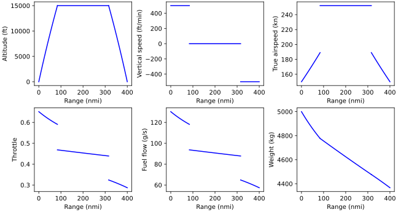

.. _Integrator-tutorial:

********************
Using the Integrator
********************

Describe how to make a model that uses the automatic time integration.
Simple example with ODE that is integrated, show the code.

A nice example might be adding fuel burn integration to the minimal example.

Run script
==========

Run it!
-------

The model should converge in a few iterations.
You can see the N2 diagram for the model :download:`here <assets/minimal_integrator_n2.html>`.
The plot it generates should look like this:

You can see that the weight is no longer constant.
This results in a varying throttle in the cruise segment, unlike the constant throttle from the :ref:`minimal example <Minimal-example-tutorial>`.
Also notice that the fuel flow and throttle have the exact same shape, which makes sense because they are directly related by a factor of TSFC.
