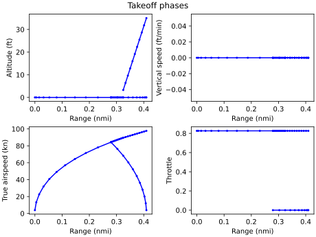
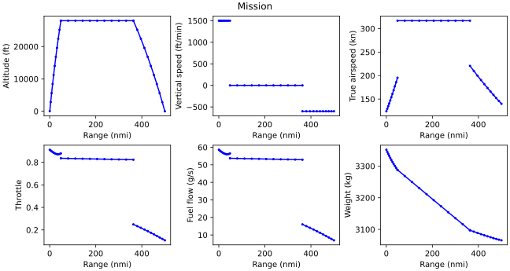

.. _Turboprop-tutorial:

************************************
Turboprop Model and Mission Analysis
************************************

This tutorial builds on the :ref:`previous tutorial <Integrator-tutorial>` by vastly improving the aircraft model.
We'll use components from OpenConcept to model the turboshaft engine, constant speed propeller, aerodynamics, and weight.
We'll also use a new mission profile that models takeoff by performing a balanced field length computation.
The model here could be considered the first "useful" aircraft model since it more accurately models the relationship between throttle, thrust, and fuel flow and also the aerodynamics.
This aircraft model is based on the Socata TBM 850 aircraft.

.. note::
  The script described in this tutorial is called TBM850.py and can be found in the examples folder.

Imports
=======

.. literalinclude:: ../../openconcept/examples/TBM850.py
    :start-after: # rst Imports (beg)
    :end-before: # rst Imports (end)

Compared to the previous openconcept/examples, this adds a handful of imports from OpenConcept.
We import the propulsion system, aerodynamic model, weight estimate, and a few math utilities.
We also import a new type of mission analysis we haven't seen in previous tutorials: ``FullMissionAnalysis``.
This includes a balanced field length takeoff calculation.
Finally, we import ``acdata`` from the TBM's data file.
``acdata`` is a dictionary that organizes aircraft parameters (this is an alternative to what we've done so far of defining these values in the mission group).

Aircraft model
==============

This aircraft model builds on the aircraft in the :ref:`integrator tutorial <Integrator-tutorial>` by replacing the simple thrust and drag model we developed with much more detailed OpenConcept models.
The propulsion system uses OpenConcept's ``TurbopropPropulsionSystem``, which couples a turboshaft engine to a constant speed propeller.
We also use OpenConcept's ``PolarDrag`` component to compute drag using a simple drag polar.
The final addition is an operating empty weight (OEW) computation.
The OEW output is not used in the weight calculation, but it is a useful output to know (perhaps for optimization) and shows off another OpenConcept component.

Let's take a look at the aircraft model as a whole and then we'll dive into each part.

.. literalinclude:: ../../openconcept/examples/TBM850.py
    :start-after: # rst Aircraft (beg)
    :end-at: # rst Weight (end)

Options
-------

The options are the same as the previous tutorials.

.. literalinclude:: ../../openconcept/examples/TBM850.py
    :start-after: # rst Options
    :end-before: # rst Setup
    :dedent: 4

Setup
-----

Now we'll break down the components of the setup method for the aircraft model.

Propulsion
~~~~~~~~~~

We use OpenConcept's ``TurbopropPropulsionSystem`` to estimate the thrust as a function of throttle.
It uses a turboshaft, which assumes constant TSFC, connected to a constant speed propeller, which uses a propeller map.

.. literalinclude:: ../../openconcept/examples/TBM850.py
    :start-after: # rst Propulsion (beg)
    :end-before: # rst Propulsion (end)
    :dedent: 8

The propulsion system requires some flight conditions, an engine rating, a propeller diameter, and a throttle.
We set the propeller speed to 2000 rpm.
The propulsion system computes thrust, which is promoted, and fuel flow, which will be connected to the fuel burn integrator.

Aerodynamics
~~~~~~~~~~~~

For the aerodynamics, we use a simple drag polar that computes drag using the equation

.. math::
    \text{drag} = q S (C_{D0} + \frac{C_L^2}{\pi e AR})

where :math:`q` is dynamic pressure, :math:`S` is wing reference area, :math:`C_{D0}` is the zero-lift drag coefficient, :math:`C_L` is the lift coefficient, :math:`e` is the span efficiency, and :math:`AR` is the aspect ratio.

.. literalinclude:: ../../openconcept/examples/TBM850.py
    :start-after: # rst Aero (beg)
    :end-before: # rst Aero (end)
    :dedent: 8

We use a different zero-lift drag coefficient for the takeoff phases than for the climb, cruise, and descent phases because we assume the aircraft is not in its clean configuration on takeoff (e.g., flaps extended).
This uses the name of the flight phase option to figure out which phase the model is in.

We then add the ``PolarDrag`` OpenConcept component and promote the necessary variables.
Some of the inputs are renamed using OpenMDAO's parenthesis format, which allows the selection on the fly of which :math:`C_{D0}` value to connect.

Weights
~~~~~~~

Finally, we add the weight models.

.. literalinclude:: ../../openconcept/examples/TBM850.py
    :start-after: # rst Weight (beg)
    :end-before: # rst Weight (end)
    :dedent: 8

We begin by adding an operating empty weight estimate, using OpenConcept's ``SingleTurboPropEmptyWeight`` component.
Including this component is not necessary because the computed OEW value is not used
in the thrust, weight, or drag estimate returned to the OpenConcept mission.
However, OEW is a useful value to know, so we compute it anyway.

It can be a little trick to figure out what is actually getting passed to the OEW component's inputs because there are so many and each one is not promoted individually (instead it uses the ``"*"`` glob pattern that promotes all of them).
You're encouraged to look at the N2 diagram to see what is being connected here.
The OEW component does not compute its own turboshaft and propeller weight because those are computed in the ``TurbopropPropulsionSystem``.

The next two components added should look pretty familiar.
We add an integrator to integrate the fuel flow computed in the ``TurbopropPropulsionSystem`` and then subtract it from the takeoff weight to compute the current weight.
One change from the integrator tutorial is instead of using an OpenMDAO ``ExecComp`` to do the final arithmetic, we use OpenConcept's ``AddSubtractComp``.
This provides an easy way to combine variables by adding and subtracting and includes analytical derivatives.

Mission
=======

This mission group has two changes from previous openconcept/examples.
The aircraft parameters are added from the data file using a ``DictIndepVarComp`` instead of manually defining them as before with an ``IndepVarComp``.
This allows the parameters to be defined in one location (that is not the run script).
The second change is the switch to using a ``FullMissionAnalysis`` mission, which adds a balanced field length calculation to the ``BasicMission`` we used previously.

The ``DictIndepVarComp`` takes in a nested Python dictionary, which in this case is imported from the TBM's aircraft data file.
Values from the dictionary can be added as outputs by calling ``add_output_from_dict`` and passing in a string with the keys for the nested dictionary for the variable you want separated by a pipe.

.. literalinclude:: ../../openconcept/examples/TBM850.py
    :start-after: # rst Mission (beg)
    :end-before: # rst Mission (end)

Run script
==========

Setup problem
-------------

We start by writing a function to set up the problem, assign solvers, and define the mission profile, just as we did in the :ref:`minimal example <Minimal-example-tutorial>`.
The new addition here is the setup of the takeoff segment.
We set initial guesses for the takeoff speeds to initialize the solver with reasonable guesses.
This improves the convergence behavior.
We also set the structural fudge value, a multiplier on the structural weights, to account for additional weights not modeled by the empty weight component.
Finally, we decrease the throttle values for the takeoff segments from the default of 1 to 0.826.

.. literalinclude:: ../../openconcept/examples/TBM850.py
    :start-after: # rst Setup problem (beg)
    :end-before: # rst Setup problem (end)

Run it!
-------

Now we get to actually run the problem.
After running it, we print some values from the solved problem.
The plotting section from previous tutorials is used twice to add a plot showing the takeoff portion of the mission.

.. literalinclude:: ../../openconcept/examples/TBM850.py
    :start-after: # rst Run (beg)
    :end-before: # rst Run (end)

The plot from the takeoff phases looks like this:

The balanced field length consists of four phases.
The first models accelerating from a standstill to the decision speed, V1.
If an engine fails (in an airplane with at least two engines) before V1, the pilot brakes to a stop.
The second phase in the legend models this braking.
If it fails after V1, the takeoff continues to the rotation speed and takes off with the remaining engine(s).
This is modeled by the third and fourth phases in the legend.

The mission looks like this:

Compared to the previous tutorial, this model more accurately models the fuel flow and thrust force.
It also incorporates a better drag model.

The N2 diagram for the model is the following:

.. embed-n2::
  ../openconcept/examples/TBM850.py

Summary
=======

In this tutorial, we created a more detailed aircraft using OpenConcept's models for propulsion, aerodynamics, and weights.
We also incorporated a mission profile that includes a balanced field length takeoff.

Hopefully, the tutorials this far have given you a baseline knowledge that is sufficient to have a general idea of what is going on in each part of OpenConcept.
From here we recommend diving into different parts of the OpenConcept source code to gain an idea of how to build more complex models.
:ref:`This page <More-examples>` recommends some models to dig through next to learn more about OpenConcept.

The final script looks like this:

.. literalinclude:: ../../openconcept/examples/TBM850.py
